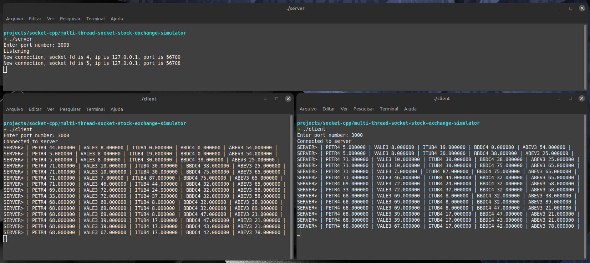

# Multi thread socket - Stock exchange simulator

Simples aplicação que simula a bolsa de valores densevolvida em C++ utilizando Socket e processamento multi-thread.

<div align="center" style="margin: 20px 0">
  
  
  <a href="https://github.com/Gabrielhsm20/multi-thread-socket-stock-exchange-simulator/commits/master" target="_blank">
    
  </a>
  <a href="https://github.com/Gabrielhsm20/multi-thread-socket-stock-exchange-simulator/issues" target="_blank">
    
  </a>
</div>

## 💻 Preview
<div align="center">
  
</div>

## 🚀 Installation
```bash
$ sudo apt-get install build-essential gdb
```

```bash
$ git clone https://github.com/Gabrielhsm20/multi-thread-socket-stock-exchange-simulator.git
$ cd multi-thread-socket-stock-exchange-simulator
```

```bash
$ g++ server.cpp -o server -lpthread
$ ./server
```

```bash
$ g++ client.cpp -o client
$ ./client
```